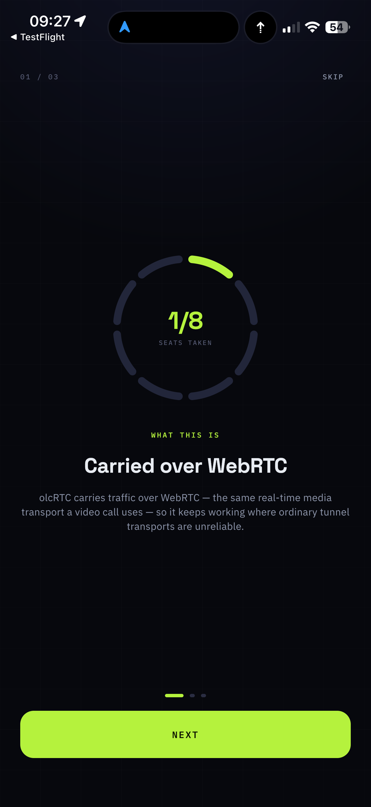
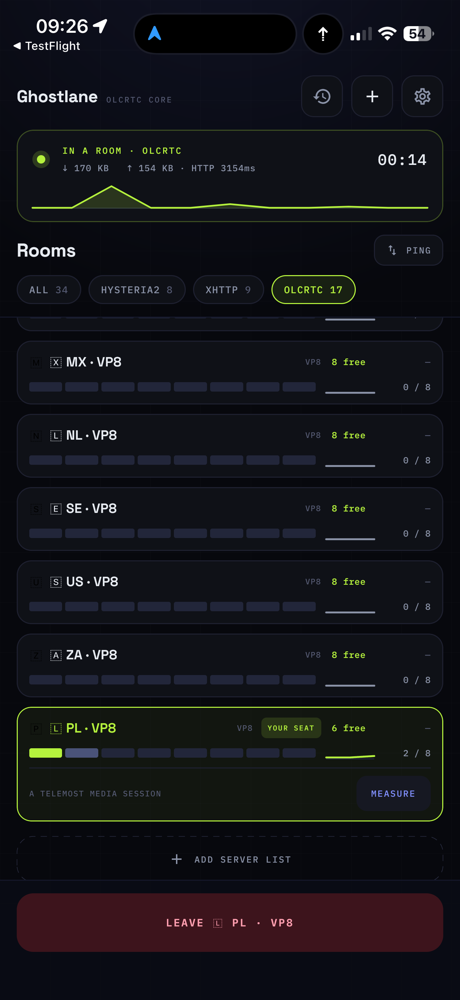
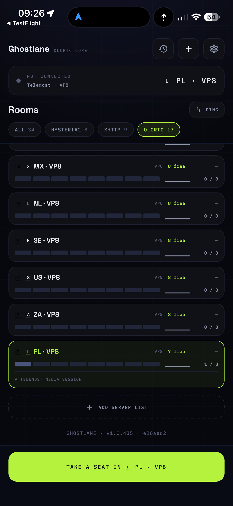
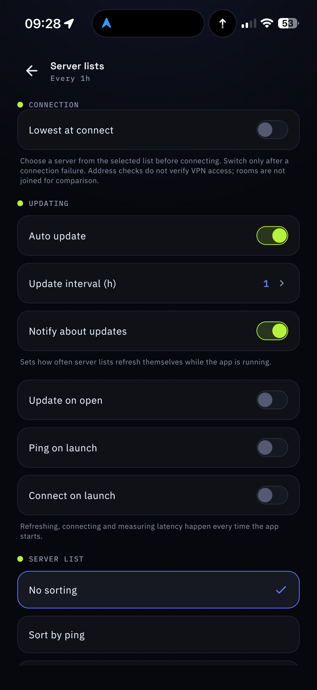

# Ghostlane

A VPN client that can hide a tunnel inside a video call. Kotlin Multiplatform
and Compose, one codebase for Android, iOS, macOS, Windows and Linux.

**olcRTC** is why this exists. Most tunnels are recognisable, and a network that
inspects what crosses it drops them on shape rather than on content. olcRTC opens
a WebRTC media session to a public meeting service and moves traffic inside it,
so what stays on the wire is a call the network already carries. Its relays hold
a fixed number of slots, and the app shows how full each room is before you join
one. We maintain the engine at
[romanpodpriatov/olcrtc](https://github.com/romanpodpriatov/olcrtc), forked from
[openlibrecommunity/olcrtc](https://github.com/openlibrecommunity/olcrtc) and
carrying our own UDP wire, multi-key support and metering.

It speaks the ordinary protocols too, because a call-shaped tunnel costs
bandwidth and is not needed until it is — and the moment you need the fallback is
the worst possible moment to be installing a second app.

It ships as **Ghostlane** and is built on the olcbox codebase, a fork of
[alananisimov/olcbox](https://github.com/alananisimov/olcbox); both copyrights
stand side by side in `LICENSE`, as MIT requires. The app's header names the
protocol rather than the fork: `Ghostlane · OLCRTC CORE`.

It is a client, not a service: you bring a server list from your provider — a
subscription URL, a QR code, or a pasted link — and the app turns it into
servers you can connect to. It is free, there is no account, nothing to sign
up for, and nothing to buy here.

<p align="center">
  
  
  
  
</p>

## The project

Ghostlane is open source and actively maintained. It is developed together with
**[olcRTC](https://github.com/romanpodpriatov/olcrtc)**, the transport engine
this application is built around; the two repositories are one project, released
separately and pinned to each other.

| | |
| --- | --- |
| How the project is run, and by whom | [GOVERNANCE.md](GOVERNANCE.md), [MAINTAINERS.md](MAINTAINERS.md) |
| How to contribute | [CONTRIBUTING.md](CONTRIBUTING.md) |
| Reporting a vulnerability | [SECURITY.md](SECURITY.md) |
| Getting help | [SUPPORT.md](SUPPORT.md) |
| Community standards | [CODE_OF_CONDUCT.md](CODE_OF_CONDUCT.md) |
| Funding, and who holds the money | [FUNDING.md](FUNDING.md) |
| Licences of what ships inside | [THIRD_PARTY_NOTICES.md](THIRD_PARTY_NOTICES.md) |
| The project as a whole, for funders and packagers | [docs/open-source-collective.md](docs/open-source-collective.md) |

Every release is gated on a suite that moves real traffic through real relays,
on every supported provider, and the report of that run is attached to the
release.

**Publishing and funding are separate things.** The mobile applications are
published on the App Store and Google Play by Globvent Inc., which holds those
developer accounts; that is its only role here. Project funding, if the
application to Open Source Collective is accepted, is held by Open Source
Collective as fiscal host, is spent in public, and is neither received nor
controlled by Globvent Inc. [FUNDING.md](FUNDING.md) says this at length.

## Protocols

| Protocol | Engine |
| --- | --- |
| olcRTC — a tunnel inside a WebRTC video call | our own engine fork |
| VLESS + Reality | sing-box |
| VLESS gRPC + Reality | sing-box |
| VLESS over TLS, incl. behind a CDN | sing-box |
| Hysteria2, with Salamander obfuscation | sing-box |
| XHTTP | Xray — sing-box has no xhttp transport |

One subscription usually carries several. The app groups them by provider,
filters by protocol, and remembers the exit last used.

Hysteria2 rides QUIC, and a carrier that throttles or drops UDP leaves it
connected and carrying nothing. On iOS the app asks the tunnel twice whether a
few hundred bytes reach a well-known endpoint, and on two failures moves to the
same exit over a transport that rides TCP — once per connect, never to another
exit, and it says so in the log.

One engine runs at a time. What hands it the packets is the platform's business,
and the platforms differ — the matrix below says how.

## Routing

Two modes, under Settings → Routing, stored beside the server lists and the same
on every platform:

| Mode | What goes where |
| --- | --- |
| All traffic through the tunnel | Everything. The exit is the server's, for every connection. |
| Bypass Russia | Russian sites, `.ru` domains and the local network go straight out; everything else rides the tunnel, name resolution included. |

The three rule-sets Bypass Russia needs — `geosite-category-ru`,
`geosite-tld-ru`, `geoip-ru` — ship inside the app and are pinned by hash, so the
mode needs nothing from the network to start working. On the networks it is for,
the lists are as likely to be unreachable as anything else.

It applies in the iOS and Android tunnels, in desktop proxy mode and in the macOS
tunnel. The Linux and Windows tunnels stay global — the cores run unprivileged
there, and a socket meant to go direct would re-enter the policy-routed tun — and
the app greys the choice out with that reason rather than quietly ignoring it. An
olcRTC room on iOS is global too: hev-socks5-tunnel hands everything to the
engine's SOCKS port and no router sits in that path.

## Server lists

You bring the list; the app turns it into servers. Paste a link, scan a QR code,
or open a file. A provider's panel or bot can also hand over a one-tap link:

```text
proofkit://add?url=<payload>
https://proofkit.org/add#<payload>
```

`proofkit` there is the scheme the app registered under its former name. It is
kept because links already handed out by providers, and copies already
installed, use it; renaming it would break them for no gain. The web spelling is
for the places that will not open a custom scheme: a phone with the app
installed opens it in the app, a phone without it lands on a page with the
downloads. There the payload rides the fragment on purpose — a fragment
never leaves the browser, so the list, which is a credential, is in nobody's
access log. For the same reason the app shows where a list came from and never
reads the link itself back out.

## Status

Shipping on every platform.

| Platform | Where it comes from |
| --- | --- |
| iOS | The App Store, as [Ghostlane](https://apps.apple.com/us/app/proofkit-vpn/id6795355210) (listed under its former name until the rename is approved) |
| Android | Universal and `armeabi-v7a` APKs on the Releases page; the `play` flavor's App Bundle goes to Google Play, on the internal testing track for now |
| macOS | Signed and notarised DMG, one per architecture |
| Windows | EXE, MSI and a portable zip |
| Linux | AppImage |

Everything except the App Store build is produced by the release workflow on
public GitHub Actions runners and published with SHA256 sums and a build
provenance attestation. The APKs are the channel nobody can revoke; the Play
bundle is the one Play updates, and it carries no self-updater for that reason.

## Credits

A fork of [alananisimov/olcbox](https://github.com/alananisimov/olcbox), which
is where the Kotlin Multiplatform configurator this grew out of came from. The
iOS packet tunnel, the sing-box and Xray transports, and the current interface
were added here; the original copyright stands alongside ours in `LICENSE`, as
MIT requires and as it should.

## Getting help

Bug reports, questions and feature requests go to the issue tracker;
[SUPPORT.md](SUPPORT.md) says what makes a report useful and what must never be
pasted into a public issue. Security problems go through the private channel in
[SECURITY.md](SECURITY.md), never an issue.

## Supporting the project

The app is free and stays free: nothing in it is sold, there is no account, and
no feature waits behind a payment. Development has been unfunded so far.

If the project is funded, the money goes to the work that keeps it alive:

- development and maintenance, including review of other people's changes;
- infrastructure: build machines, the relays the release gate exercises, code
  signing and notarisation, developer program fees;
- testing: devices, and network access in the places this software is for;
- security: audits, dependency review, and rewards for reported vulnerabilities
  when the budget allows;
- documentation and translation;
- compensation of maintainers and contributors for actual project work.

Funding would be held by Open Source Collective as fiscal host, and every
contribution and expense is public and itemised there. Globvent Inc., which
publishes the mobile applications, neither receives nor controls those funds.
[FUNDING.md](FUNDING.md) sets out the rules, including the ones the maintainers
hold themselves to when they are paid.

> **Здесь ничего не продаётся.** Ни приложение, ни доступ, ни конфигурации, ни
> списки серверов, ни поддержка. Проект принимает только добровольное
> финансирование и тратит его открыто: см. [FUNDING.md](FUNDING.md).

## Legal Notice
This software is intended for development, testing and research purposes only.

The project does not provide any guarantees regarding:
- availability of network access
- compatibility with specific services
- compliance with any external restrictions

Users are solely responsible for how they use this software and must comply with applicable laws.

## Usage Restrictions
This software is not intended to be used for bypassing access restrictions or violating applicable laws.
The project does not support or encourage such use.

## Features
- One tap to connect, with the session's elapsed time and traffic on screen.
- Server lists by link, QR code or file; grouped, foldable, and refreshed on
  a schedule you choose. A `proofkit://` or `proofkit.org/add` link imports one
  without a paste.
- What the provider says about your plan — quota, expiry, its own support and
  web links — read from the server list's own headers.
- olcRTC rooms carry their occupancy on the board, and say out loud when one is
  full or its key is no longer good rather than failing at connect.
- olcRTC on a server that moves its clients between rooms: the next room is read
  off the server list's `##rooms` header, handed to the engine while the session
  is live, and re-read through the tunnel after every handover - on iOS by the
  tunnel extension itself, since the app is asleep by then
  (docs/ios-room-failover.md).
- Latency where it can honestly be measured: through the tunnel for the
  connection you are on; for a server you are not connected to, ICMP first and a
  TCP connect to the port the link names where ICMP is filtered. An olcRTC room
  has no address to probe, so it is timed only while you are in it, by a request
  through the tunnel.
- Sorting by ping or name, filtering by protocol, duplicate subscriptions
  refreshed rather than added twice, and a location or a whole list removed from
  the board itself.
- A failure that says what failed: a link asking for a transport its provider
  cannot carry, a dead key, an empty room, a tunnel that came up but carried
  nothing.
- Routing modes: everything through the tunnel, or Russia and the local network
  direct.
- Diagnostics log with export, and a failed connection that says why. Server
  addresses are replaced by short tags before a line reaches the log, so the
  file is safe to send to anyone and still says which hop failed.
- TUN and proxy modes wherever the platform has both, SOCKS5 listen address and
  credentials, Android split tunneling.
- Network migration, reconnect handling, and watchdog recovery.
- No account, no analytics, nothing collected.

## Platform Matrix

| Platform | Modes | What carries the packets | Engines |
| --- | --- | --- | --- |
| Android | TUN, proxy | `VpnService` + `hev-socks5-tunnel` | sing-box and Xray as packaged native binaries, olcRTC bound in-process |
| iOS | System VPN | sing-box's own tun for Reality and Hysteria2; `hev-socks5-tunnel` in front of Xray and olcRTC | all three in one `Cores.xcframework` inside the extension |
| macOS | TUN, proxy | root daemon via `SMAppService` running sing-box; OS proxy settings and a PAC otherwise | bundled sing-box and Xray, olcRTC as a child process |
| Windows | TUN, proxy | supervised sing-box TUN + Wintun; OS proxy settings otherwise | as macOS |
| Linux | TUN | `hev-socks5-tunnel` + policy routes | as macOS |

The desktop apps can also lend the tunnel to another device on the same local
network — a phone, a TV, a laptop that must not have a client installed — as an
authenticated SOCKS5 listener on one private address. It is off by default, the
network it was enabled on is pinned by its gateway, and what it costs is in
`docs/lan-sharing.md`.

iOS is the odd one because an `NEPacketTunnelProvider` gets about 50 MB. sing-box
owning the tun in front of a second Go engine buffers every connection twice and
serves it with twice the goroutines; a speed test killed the extension outright.
The measurements and what replaced it are in `docs/ios-one-go-runtime.md`.

## Requirements

| Area | Requirement |
| --- | --- |
| JVM | JDK 21 — what CI builds with; the Android source and target level is 17 |
| Android | Android Studio, SDK 37, NDK 28.2.13676358 |
| Desktop native assets | Go 1.26.5 and a local `olcrtc` checkout |
| iOS | macOS and Xcode; the first build fetches `Cores.xcframework` and `HevSocks5Tunnel.xcframework` from this repository's release tags |
| Linux TUN | `iproute2`, `/dev/net/tun`, root/Polkit/sudo privileges |
| Windows TUN | UAC elevation when TUN starts and bundled Wintun runtime |

Default local `olcrtc` path:

```text
../olcrtc
```

Override it with `OLCRTC_REPO`:

```bash
OLCRTC_REPO=/path/to/olcrtc ./gradlew :desktopApp:run
```

Relative `OLCRTC_REPO` values are resolved from this project's root:

```bash
OLCRTC_REPO=../olcrtc-ansible-deploy/olcrtc ./gradlew :androidApp:assembleGithubRelease
```

```powershell
$env:OLCRTC_REPO="C:\path\to\olcrtc"
.\gradlew.bat :desktopApp:run
```

## Commands

| Task | Command |
| --- | --- |
| Android debug APK | `./gradlew :androidApp:assembleDebug` |
| Install Android debug APK | `./gradlew :androidApp:installGithubDebug` |
| iOS simulator app | `xcodebuild -project iosApp/iosApp.xcodeproj -scheme iosApp -sdk iphonesimulator -configuration Debug build` |
| Run desktop app | `./gradlew :desktopApp:run` |
| Run desktop app with hot reload | `./gradlew :desktopApp:hotRun --auto` |
| Build desktop native assets | `./gradlew :desktopApp:buildDesktopNativeAssets` |
| Package current host OS | `./gradlew :desktopApp:packageReleaseDistributionForCurrentOS` |
| Main checks | `./gradlew :sharedUI:jvmTest :desktopApp:compileKotlin :androidApp:assembleDebug` |
| JVM tests | `./gradlew :sharedUI:jvmTest` |
| Run the emitted configs past sing-box itself | `scripts/check-singbox-configs.sh` |

The main checks are what PR checks run, in that order; `check-singbox-configs.sh`
follows them there, starting the shapes rather than only checking them.

## Build Outputs

| Target | Command | Output |
| --- | --- | --- |
| Android debug | `./gradlew :androidApp:assembleDebug` | `androidApp/build/outputs/apk/github/debug/androidApp-github-debug.apk` |
| Android release | `./gradlew :androidApp:assembleGithubRelease` | `androidApp/build/outputs/apk/github/release/androidApp-github-release.apk` |
| Android App Bundle for Play | `./gradlew :androidApp:bundlePlayRelease` | `androidApp/build/outputs/bundle/playRelease/androidApp-play-release.aab` |
| iOS simulator | `xcodebuild -project iosApp/iosApp.xcodeproj -scheme iosApp -sdk iphonesimulator -configuration Debug build` | Xcode DerivedData app product |
| macOS DMG | `./gradlew :desktopApp:packageReleaseDmg` | `desktopApp/build/compose/binaries/main-release/dmg/Ghostlane-<version>.dmg` |
| Windows EXE | `.\gradlew.bat :desktopApp:packageReleaseExe` | `desktopApp\build\compose\binaries\main-release\exe\Ghostlane-<version>.exe` |
| Windows MSI | `.\gradlew.bat :desktopApp:packageReleaseMsi` | `desktopApp\build\compose\binaries\main-release\msi\Ghostlane-<version>.msi` |
| Windows portable zip | `.\gradlew.bat :desktopApp:packageReleasePortableZip` | `desktopApp\build\compose\binaries\main-release\portable\Ghostlane-<version>-windows-amd64-portable.zip` |
| Linux AppImage | `./gradlew :desktopApp:packageReleaseLinuxAppImage` | `desktopApp/build/compose/binaries/main-release/appimage/Ghostlane-<version>-amd64.AppImage` |

## Native Assets

Built into `desktopApp/build/generated/desktopNativeResources/` by
`buildDesktopNativeAssets`, which verifies the set the host actually needs:

| Asset | Path |
| --- | --- |
| macOS `olcrtc` | `native/olcrtc-darwin-<arch>` |
| macOS `olcrtc` library, for room checks | `native/libolcrtc-darwin-<arch>.dylib` |
| macOS tunnel-daemon bridge | `native/libolcboxtunneld.dylib` |
| Windows `olcrtc` | `native/olcrtc-windows-amd64.exe`, `native/olcrtc-windows-amd64.dll` |
| Windows Wintun runtime | `native/wintun.dll` |
| Linux `olcrtc` | `native/olcrtc-linux-<arch>`, `native/libolcrtc-linux-<arch>.so` |
| Linux `hev-socks5-tunnel` | `native/hev-socks5-tunnel-linux-<arch>` |

`<arch>` is `arm64` or `amd64`. The macOS bridge is why a missing asset is worth
a failed build rather than a warning: absent, the settings row for the system-wide
tunnel simply does not appear, and nothing anywhere says why.

## Notes

- Android native ABIs: `armeabi-v7a`, `arm64-v8a`, `x86_64`, picked with
  `-Polcbox.android.abiFilters`. The release builds a universal APK and a
  separate `armeabi-v7a` one.
- The `github` flavor carries the in-app updater, which looks at this
  repository's releases; the `play` flavor drops it along with the two
  permissions Play refuses.
- Android release builds require `keystore.properties` in the repository root.
- sing-box and Xray are **not** produced by `buildDesktopNativeAssets`. The
  release workflow downloads the pinned versions — sing-box 1.13.14, Xray
  25.3.6 — into `desktopApp/src/main/resources/native/` before packaging, so a
  locally packaged build starts olcRTC locations and fails on the rest until
  those two binaries are put there by hand.
- The release workflow signs and notarises every macOS build, published or not:
  `SMAppService` refuses to register the tunnel daemon from an un-notarised
  bundle. A local `packageReleaseDmg` is neither unless `MACOS_SIGN_IDENTITY`
  and the notary credentials are set.
- Windows installers must be built on Windows with `jpackage` and WiX available.
- Linux TUN interface: `olcbox0`.
- Linux stop removes policy routes and reverts `systemd-resolved` settings when
  `resolvectl` is available.

`keystore.properties`:

```properties
storeFile=/absolute/path/to/release.keystore
storePassword=...
keyAlias=...
keyPassword=...
```

Linux privilege override:

```bash
OLCBOX_LINUX_PRIVILEGE=sudo ./gradlew :desktopApp:run
OLCBOX_LINUX_PRIVILEGE=pkexec ./gradlew :desktopApp:run
```
