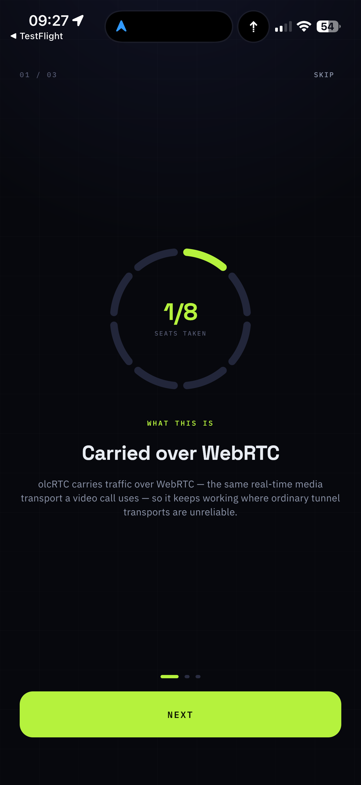
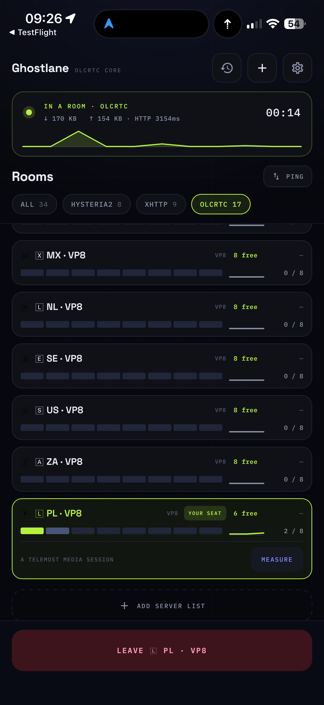
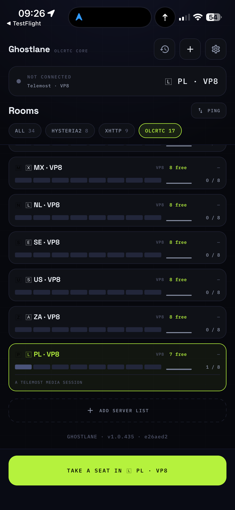
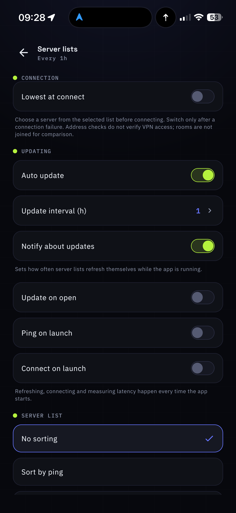

<p align="center">
  
</p>

<h1 align="center">Ghostlane</h1>

<p align="center">
  <b>A tunnel inside a video call.</b><br>
  An open-source VPN client for Android, iOS, macOS, Windows and Linux.<br>
  Free, with no account, no tracking and nothing to buy.
</p>

<!-- The release badge takes no include_prereleases/sort/filter: with any of them
     shields.io lists every release of this repository (about 150, 30 assets each)
     and answers 408, which the GitHub app shows as a broken image. The plain
     endpoint reads GitHub's own "latest" release, which the release workflow
     marks. -->
<!-- Store badges: the owners' official artwork, unmodified (docs/badges/). The App
     Store badge comes first and in black, as Apple asks when other stores' badges
     are beside it. Widths, not heights: GitHub sets height:auto on README images.
     168 px shows Apple's badge 56 px tall; Google's PNG carries a transparent
     margin, so 217 px shows its badge 56 px tall too, as Google asks (the same
     size or larger). -->
<p align="center">
  <a href="https://apps.apple.com/app/id6795355210"></a>
  &nbsp;
  <a href="https://play.google.com/store/apps/details?id=org.proofkit.app"></a>
</p>

<p align="center">
  macOS, Windows, Linux and Android APKs: <a href="https://github.com/ghostlane-project/ghostlane/releases">GitHub Releases</a><br>
  Linux servers: the <code>ghostlane</code> command — apt and dnf repositories, a Docker image, or the signed installer on the release page; see <a href="docs/cli.md">docs/cli.md</a>
</p>

<p align="center">
  <a href="LICENSE"></a>
  <a href="https://github.com/ghostlane-project/ghostlane/releases"></a>
  <a href="https://github.com/ghostlane-project/ghostlane/actions/workflows/pr-checks.yml"></a>
</p>

<p align="center">
  
  
  
  
</p>

<p align="center">
  <a href="#features">Features</a> ·
  <a href="#protocols">Protocols</a> ·
  <a href="#routing">Routing</a> ·
  <a href="#server-lists">Server lists</a> ·
  <a href="#download">Download</a> ·
  <a href="#getting-help">Help</a> ·
  <a href="#building-from-source">Build</a>
</p>

Built with Kotlin Multiplatform and Compose: one codebase for Android, iOS,
macOS, Windows and Linux.

**olcRTC** is why this exists. Most tunnels are recognisable, and a network that
inspects what crosses it drops them on shape rather than on content. olcRTC opens
a WebRTC media session to a public meeting service and moves traffic inside it,
so what stays on the wire is a call the network already carries. Its relays hold
a fixed number of slots, and the app shows how full each room is before you join
one. We maintain the engine at
[ghostlane-project/olcrtc](https://github.com/ghostlane-project/olcrtc), forked from
[openlibrecommunity/olcrtc](https://github.com/openlibrecommunity/olcrtc) and
carrying our own UDP wire, multi-key support and metering.

It speaks the ordinary protocols too, because a call-shaped tunnel costs
bandwidth and is not needed until it is — and the moment you need the fallback is
the worst possible moment to be installing a second app.

It ships as **Ghostlane** and is built on the olcbox codebase, a fork of
[alananisimov/olcbox](https://github.com/alananisimov/olcbox); both copyrights
stand side by side in `LICENSE`, as MIT requires. The app's header names the
protocol rather than the fork: `Ghostlane · OLCRTC CORE`.

It is a client, not a service: you bring a server list from your provider — a
server-list URL, a QR code, or a pasted link — and the app turns it into
servers you can connect to. It is free, there is no account, nothing to sign
up for, and nothing to buy here.

## The project

Ghostlane is open source and actively maintained. It is developed together with
**[olcRTC](https://github.com/ghostlane-project/olcrtc)**, the transport engine
this application is built around; the two repositories are one project, released
separately and pinned to each other.

| | |
| --- | --- |
| How the project is run, and by whom | [GOVERNANCE.md](GOVERNANCE.md), [MAINTAINERS.md](MAINTAINERS.md) |
| How to contribute | [CONTRIBUTING.md](CONTRIBUTING.md) |
| Reporting a vulnerability | [SECURITY.md](SECURITY.md) |
| Getting help | [SUPPORT.md](SUPPORT.md) |
| Community standards | [CODE_OF_CONDUCT.md](CODE_OF_CONDUCT.md) |
| Funding, and who holds the money | [FUNDING.md](FUNDING.md) |
| Licences of what ships inside | [THIRD_PARTY_NOTICES.md](THIRD_PARTY_NOTICES.md) |
| The project as a whole, for funders and packagers | [docs/open-source-collective.md](docs/open-source-collective.md) |

Every release is gated on a suite that moves real traffic through real relays,
on every supported provider, and the report of that run is attached to the
release.

**Publishing and funding are separate things.** The mobile applications are
published on the App Store and Google Play by Globvent Inc., which holds those
developer accounts; that is its only role here. Project funding, if the
application to Open Source Collective is accepted, is held by Open Source
Collective as fiscal host, is spent in public, and is neither received nor
controlled by Globvent Inc. [FUNDING.md](FUNDING.md) says this at length.

## Features
- One tap to connect, with the session's elapsed time and traffic on screen.
- In English, Russian, Chinese and Persian, following the system's language;
  Persian is laid out right to left on Android.
- Server lists by link, QR code or file; grouped, foldable, and refreshed on
  a schedule you choose. A `ghostlane://`, `proofkit://` or `proofkit.org/add`
  link imports one without a paste.
- What the provider says about your plan — quota, expiry, a short note, its own
  support and web links — read from the server list's own headers, and a list
  that survives its provider's blocked domain (see Server lists).
- Smart connect: another transport when one is blocked, olcRTC in the same
  country when nothing else gets through (Android and the desktop). On Android
  it also moves a session whose server stopped answering to another server of
  the same country, and says where; a desktop session moves the same way from
  a server the app is already retrying, and does not notice one that has only
  gone quiet (see Protocols).
- olcRTC rooms carry their occupancy on the board, and say out loud when one is
  full or its key is no longer good rather than failing at connect.
- olcRTC on a server that moves its clients between rooms: the next room is read
  off the server list's `##rooms` header, handed to the engine while the session
  is live, and re-read through the tunnel after every handover - on iOS by the
  tunnel extension itself, since the app is asleep by then
  (docs/ios-room-failover.md).
- Latency where it can honestly be measured: through the tunnel for the
  connection you are on; for a server you are not connected to, ICMP first and a
  TCP connect to the port the link names where ICMP is filtered. An olcRTC room
  has no address to probe, so it is timed only while you are in it, by a request
  through the tunnel.
- Sorting by ping or name, filtering by protocol, duplicate server lists
  refreshed rather than added twice, and a location or a whole list removed from
  the board itself.
- A failure that says what failed: a link asking for a transport its provider
  cannot carry, a dead key, an empty room, a tunnel that came up but carried
  nothing.
- Routing: everything through the tunnel; Russia, Iran or China and the local
  network direct; or only blocked sites through the tunnel. Rules of your own on
  top (see Routing).
- Servers for your router: each server of a list as its link or a sing-box
  outbound for Podkop on OpenWrt, or as an Xray outbound for XKeen on Keenetic.
  Encrypted server lists do not offer it: their provider chose that their
  servers are not read out of them.
- Diagnostics log with export, and a failed connection that says why. Server
  addresses are replaced by short tags before a line reaches the log, so the
  file is safe to send to anyone and still says which hop failed.
- TUN and proxy modes wherever the platform has both, SOCKS5 listen address and
  credentials, Android split tunneling with a preset for Russian apps that
  refuse to work through a VPN.
- Android: always-on VPN (the connection comes up by itself after a restart),
  and a quick-settings tile. While connected, the settings row says whether
  Android's always-on is on and whether "Block connections without VPN" is
  on with it, which is the kill switch for the case the app cannot cover, its
  own death, and names the apps that setting leaves without network.
- Android TV: a launcher entry, a focus mark you can see from the sofa, and a
  server list sent from your phone. The TV shows a code, and the phone opens a
  one-page form on the same home network.
- On Android and iPhone, the local SOCKS ports between the tunnel and its
  engine ask for a login only the app knows, so another app on the phone cannot
  use them or learn the exit. On Android the port also changes with every
  connect.
- Network migration, reconnect handling, and watchdog recovery.
- iPhone: the tunnel takes IPv6 as well as IPv4. It used to take IPv4 only, and
  on a network that hands out IPv6 a connection to an IPv6 address went out
  directly, at the phone's own address, with the VPN shown as connected.
- Android holds the tunnel for the whole session: a reconnect, another server, a
  lost network or a restarted engine all happen behind the VPN interface, which
  stays up until you disconnect, so there is no moment when the apps on the VPN
  go out around it. While it reconnects those apps wait, and the notification
  says so. What the app cannot hold is its own death; for that Android has
  "Always-on VPN" with "Block connections without VPN".
- On the desktop a core or an olcRTC engine that dies is restarted behind the
  tunnel instead of taking it down: the tunnel stays as it is, and apps wait
  behind it, rather than going out directly, while the process comes back on
  the port it had. A dead sing-box or Xray core is noticed now; it used to leave
  a session that said Connected and carried nothing. The death of the tunnel's
  own process still ends the session.
- On the desktop another server chosen while connected is started behind the
  tunnel as well. The tunnel is built once, for the session, and is not taken
  down, rebuilt or started again for the new server, so there is no moment
  between the two when traffic goes out directly; a server that does not answer
  is retried behind it. On Linux the tunnel's password is not asked for again
  (an olcRTC room still asks, for its engine). Changing the connection mode,
  the routing or the SOCKS port and login still restarts the whole connection.
- Linux desktop: a kill switch for that last case, off by default (Settings,
  Connection). When the tunnel's own process stops, its route goes with it and
  traffic would leave directly; with the switch on, a second route in the
  tunnel's table drops it instead, the local network included, and the app
  says so. It stays blocked until you connect again, which puts a tunnel back
  without opening the block, or turn the switch off; either asks for the
  administrator password. Nothing else removes it: not a connect that fails,
  not Cancel, not quitting the app. It is routes and rules, so it holds for as
  long as they stand, and for what they cover: not across a restart of the
  computer; not for programs running as root or for what the computer forwards
  for containers and virtual machines, neither of which the Linux tunnel has
  ever carried; and not for a program that binds its sockets to a network
  interface. The `ghostlane` command has a kill switch of its own, which its
  daemon also keeps between servers and puts back after a crash
  ([docs/cli.md](docs/cli.md)); the desktop app has no such daemon.
- On the desktop a server that stays down no longer keeps the session on it.
  With smart connect on, a server that is being retried behind the tunnel (a
  core or an olcRTC engine that died and did not come back, or a server chosen
  while connected that never answered) is given two failed attempts and half a
  minute; then the other servers of the same country in the same list are
  tried behind the tunnel, which stays as it is, and the first that carries
  traffic becomes the active one, with a message that says which. The tunnel
  is never taken down for it, and no password dialog opens by itself: on Linux
  a session on any other server is not moved into an olcRTC room, and one that
  is in a room moves only once that room's engine has stopped and is asking
  for the password already. A server that goes quiet while its core keeps
  running is not noticed on the desktop.
- No account, no analytics, nothing collected.

## Protocols

| Protocol | Engine |
| --- | --- |
| olcRTC — a tunnel inside a WebRTC video call | our own engine fork |
| VLESS + Reality, over TCP, gRPC or HTTP/2 (`type=http`) | sing-box |
| VLESS over TLS, incl. behind a CDN, over TCP, WebSocket, HTTPUpgrade or HTTP/2; a link's `allowInsecure` is honoured, and `security=none` is VLESS with no TLS | sing-box |
| Hysteria2, with Salamander obfuscation | sing-box |
| Trojan | sing-box |
| Shadowsocks, AEAD and 2022 | sing-box |
| VMess | sing-box |
| XHTTP | Xray — sing-box has no xhttp transport |

A link that asks for something the app cannot carry — a Shadowsocks plugin or
stream cipher, Trojan over Reality, VMess over mKCP or QUIC — is left out at
import rather than added as a server that can never connect.

olcRTC rides five meeting services: Yandex Telemost, WB Stream, Sber SaluteJazz,
VK Calls and Jitsi. A server list says which one each room is on, and a provider
that offers one exit over several of them shows up as a server per service.
SaluteJazz admits a guest to a call's data channels only, so its rooms always
run over `datachannel`; a VK Calls room is its call's join link, and runs over
`vp8channel`. An experimental switch in the connection settings opens olcRTC's
encrypted connection the way Chrome does, for networks that refuse the WebRTC
library's own.

One server list usually carries several. The app groups them by provider,
filters by protocol, and remembers the exit last used.

Hysteria2 rides QUIC, and a carrier that throttles or drops UDP leaves it
connected and carrying nothing. On iOS the app asks the tunnel twice whether a
few hundred bytes reach a well-known endpoint, and on two failures moves to the
same exit over a transport that rides TCP — once per connect, never to another
exit, and it says so in the log.

**Smart connect**, on Android and the desktop, checks before a connect instead,
for a server published over several transports. Through each one it asks for a
`204` and then for 64 KB whole: Russian DPI lets a connection to a foreign
address carry its first 16–20 KB and then freezes it, so one small request passes
exactly where browsing then stalls. It takes the first transport that passes,
starting with the one that worked last time, and ends on olcRTC in the same
country. When only domestic sites answer — a mobile "whitelist" shutdown — it
goes to olcRTC first. It never changes the country, and it can be turned off in
the server-list settings.

The same switch covers a server that dies during a session, on Android and the
desktop. After two failed reconnects and half a minute without the server, with
a network present, the app tries the other transports of the same exit, then the
other servers of the same country in the same list, then olcRTC of that country.
A candidate is checked by an engine of its own first, so a dead one costs a check
and not a reconnect, and all of it happens behind the tunnel the session keeps
up. The first line that carries traffic becomes the active one, and the app says
which. It never changes the country or the list, and nothing moves back by
itself.

The desktop differs in three things. The count begins from a server the app is
already retrying: a core or an olcRTC engine that died, or a server chosen while
connected that never answered. A server that goes quiet under a core that keeps
running is not noticed there, so nothing moves. olcRTC does not go first on a
whitelisted network: from behind its own tunnel the app cannot ask which kind of
network it is on, and "a network is present" means the machine still has a
default route of its own. And on Linux, where an olcRTC engine runs as root and
starting one asks for the administrator's password, no dialog is opened for a
move nobody asked for: a session on any other server goes only to servers whose
cores ask for nothing, and a session in a room moves only once that room's
engine has stopped, when its own restart is asking already.

One engine runs at a time. What hands it the packets is the platform's business,
and the platforms differ — the matrix below says how.

## Routing

Settings → Routing, stored beside the server lists:

| Mode | What goes where |
| --- | --- |
| All traffic through the tunnel | Everything. The exit is the server's, for every connection. |
| Bypass Russia | Russian sites, Russian top-level domains and the local network go straight out; everything else rides the tunnel, name resolution included. |
| Bypass Iran | The same, for Iranian destinations. |
| Bypass China | The same, for Chinese destinations. |
| Only blocked sites through the tunnel | The inverse: sites blocked in Russia, and services that shut Russian users out, ride the tunnel; everything else goes straight out. |

In any mode you can add rules of your own: a domain, which covers its
subdomains, or an address or prefix that always goes direct or always through
the tunnel. They win over the mode's lists.

The lists ship inside the app and are pinned by hash, so no mode needs anything
from the network to start working; on the networks they are for, the lists are
as likely to be unreachable as anything else. The bypass modes use v2fly's
`category-ru`, `tld-ru` and `geoip-ru`; `category-ir` and `geoip-ir`; `cn`,
`tld-cn` and `geoip-cn`. Blocked-only uses
[Re:filter](https://github.com/1andrevich/Re-filter-lists) (MIT), which lists
whole address ranges of some large services, so other sites hosted there ride
the tunnel too.

Where it applies:

| Platform | What applies |
| --- | --- |
| Android, TUN and proxy | Every mode and your rules. An olcRTC room applies them itself, from the engine's direct rules, which say "these go direct" and nothing else. So in a room blocked-only carries everything, and a tunnel rule can only take a site out of the region's list: a site under a whole-TLD entry such as `domain:ru` stays direct |
| iOS | All traffic, or Bypass Russia; an olcRTC room applies it from the engine's direct rules |
| macOS, proxy and tunnel | Every mode and your rules |
| Windows | Every mode and your rules in proxy mode. The Windows tunnel carries everything, and the routing screen says to use proxy mode for it |
| Linux | olcRTC rooms: a bypass and your rules, as in a room on Android. The engine runs as root there, and root keeps its own route out of the tunnel. Other servers carry everything: their cores run as the user and reach the server bound to the physical interface, and the rules have not been moved there. The routing screen says so and does not offer blocked-only |

## Server lists

You bring the list; the app turns it into servers. Paste a link, scan a QR code,
or open a file. A provider's panel or bot can also hand over a one-tap link:

```text
ghostlane://add?url=<payload>
ghostlane://add/<server-list URL>
https://proofkit.org/add#<payload>
```

The path form is the one provider pages write for every client, the URL raw or
percent-encoded. `proofkit://`, the scheme the app registered under its former
name, still works the same way. It is kept because links already handed out by
providers, and copies already installed, use it; dropping it would break them
for no gain. The web spelling is
for the places that will not open a custom scheme: a phone with the app
installed opens it in the app, a phone without it lands on a page with the
downloads. There the payload rides the fragment on purpose — a fragment
never leaves the browser, so the list, which is a credential, is in nobody's
access log. For the same reason the app shows where a list came from and never
reads the link itself back out.

A provider can say more in the list's own HTTP headers, in the forms other
clients read:
- `profile-title`;
- `subscription-userinfo` (traffic and expiry);
- `support-url` and `profile-web-page-url`;
- `profile-update-interval`;
- `announce`, a short note shown under the list on Android and the desktop.

Two headers keep a list alive when its address is blocked:
- `fallback-url` names a spare address, which the app asks when the usual one
  does not answer;
- `new-url` or `new-domain` moves the list for good.

Both are honoured only from an HTTPS answer and only to an HTTPS address: over
plain HTTP anyone on the path could write them, and a moved list never comes
back by itself.

## Download

Shipping on every platform.

| Platform | Where it comes from |
| --- | --- |
| iOS | The [App Store](https://apps.apple.com/app/id6795355210). [TestFlight](https://testflight.apple.com/join/sU7aTHQv) gets every release the day it is cut; the App Store follows after App Review, so it can be a version or two behind |
| Android | [Google Play](https://play.google.com/store/apps/details?id=org.proofkit.app), or the universal and `armeabi-v7a` APKs on the [Releases](https://github.com/ghostlane-project/ghostlane/releases) page. The same app installs on Android TV |
| macOS | Signed and notarised DMG, one per architecture |
| Windows | EXE, MSI and a portable zip |
| Linux | AppImage |
| Linux servers | `ghostlane-cli`: deb, rpm, apk, Arch and tarballs for amd64/arm64/armv7 with a signed installer, signed [apt and dnf repositories](https://ghostlane-project.github.io/ghostlane/) and a Docker image (`ghcr.io/ghostlane-project/ghostlane-cli`) — a headless daemon with tun (optional kill switch) and proxy modes, see [docs/cli.md](docs/cli.md) |

Everything except the App Store build is produced by the release workflow on
public GitHub Actions runners and published with SHA256 sums and a build
provenance attestation. The APKs are the channel nobody can revoke; the Play
bundle is the one Play updates, and it carries no self-updater for that reason.

## Getting help

Bug reports, questions and feature requests go to the issue tracker;
[SUPPORT.md](SUPPORT.md) says what makes a report useful and what must never be
pasted into a public issue. Security problems go through the private channel in
[SECURITY.md](SECURITY.md), never an issue.

## Supporting the project

The app is free and stays free: nothing in it is sold, there is no account, and
no feature waits behind a payment. Development has been unfunded so far.

If the project is funded, the money goes to the work that keeps it alive:

- development and maintenance, including review of other people's changes;
- infrastructure: build machines, the relays the release gate exercises, code
  signing and notarisation, developer program fees;
- testing: devices, and network access in the places this software is for;
- security: audits, dependency review, and rewards for reported vulnerabilities
  when the budget allows;
- documentation and translation;
- compensation of maintainers and contributors for actual project work.

Funding would be held by Open Source Collective as fiscal host, and every
contribution and expense is public and itemised there. Globvent Inc., which
publishes the mobile applications, neither receives nor controls those funds.
[FUNDING.md](FUNDING.md) sets out the rules, including the ones the maintainers
hold themselves to when they are paid.

> **Здесь ничего не продаётся.** Ни приложение, ни доступ, ни конфигурации, ни
> списки серверов, ни поддержка. Проект принимает только добровольное
> финансирование и тратит его открыто: см. [FUNDING.md](FUNDING.md).

## Building from source

Everything below is for building the app yourself; the downloads above need none of it.

### Platform Matrix

| Platform | Modes | What carries the packets | Engines |
| --- | --- | --- | --- |
| Android | TUN, proxy | `VpnService` + `hev-socks5-tunnel` | sing-box and Xray as packaged native binaries, olcRTC bound in-process |
| iOS | System VPN | sing-box's own tun for Reality and Hysteria2; `hev-socks5-tunnel` in front of Xray and olcRTC | all three in one `Cores.xcframework` inside the extension |
| macOS | TUN, proxy | root daemon via `SMAppService` running sing-box; OS proxy settings and a PAC otherwise | bundled sing-box and Xray, olcRTC as a child process |
| Windows | TUN, proxy | supervised sing-box TUN + Wintun; OS proxy settings otherwise | as macOS |
| Linux | TUN | `hev-socks5-tunnel` + policy routes; an optional kill switch on a dummy device | as macOS |

The desktop apps can also lend the tunnel to another device on the same local
network — a phone, a TV, a laptop that must not have a client installed — as an
authenticated SOCKS5 listener on one private address. It is off by default, the
network it was enabled on is pinned by its gateway, and what it costs is in
`docs/lan-sharing.md`.

iOS is the odd one because an `NEPacketTunnelProvider` gets about 50 MB. sing-box
owning the tun in front of a second Go engine buffers every connection twice and
serves it with twice the goroutines; a speed test killed the extension outright.
The measurements and what replaced it are in `docs/ios-one-go-runtime.md`.

### Requirements

| Area | Requirement |
| --- | --- |
| JVM | JDK 21 — what CI builds with; the Android source and target level is 17 |
| Android | Android Studio, SDK 37, NDK 28.2.13676358 |
| Desktop native assets | Go 1.26.5 and a local `olcrtc` checkout |
| iOS | macOS and Xcode; the first build fetches `Cores.xcframework` and `HevSocks5Tunnel.xcframework` from this repository's release tags |
| Linux TUN | `iproute2`, `/dev/net/tun`, root/Polkit/sudo privileges; Linux 5.7 or later for any server other than an olcRTC room (the core is bound to the physical interface, which older kernels allow only to root). The kill switch needs the kernel's `dummy` device; without it the tunnel comes up without the switch, and the log says so |
| Windows TUN | UAC elevation when TUN starts and bundled Wintun runtime |

Default local `olcrtc` path:

```text
../olcrtc
```

Override it with `OLCRTC_REPO`:

```bash
OLCRTC_REPO=/path/to/olcrtc ./gradlew :desktopApp:run
```

Relative `OLCRTC_REPO` values are resolved from this project's root:

```bash
OLCRTC_REPO=../olcrtc-ansible-deploy/olcrtc ./gradlew :androidApp:assembleGithubRelease
```

```powershell
$env:OLCRTC_REPO="C:\path\to\olcrtc"
.\gradlew.bat :desktopApp:run
```

### Commands

| Task | Command |
| --- | --- |
| Android debug APK | `./gradlew :androidApp:assembleDebug` |
| Install Android debug APK | `./gradlew :androidApp:installGithubDebug` |
| iOS simulator app | `xcodebuild -project iosApp/iosApp.xcodeproj -scheme iosApp -sdk iphonesimulator -configuration Debug build` |
| Run desktop app | `./gradlew :desktopApp:run` |
| Run desktop app with hot reload | `./gradlew :desktopApp:hotRun --auto` |
| Build desktop native assets | `./gradlew :desktopApp:buildDesktopNativeAssets` |
| Package current host OS | `./gradlew :desktopApp:packageReleaseDistributionForCurrentOS` |
| Main checks | `./gradlew :sharedUI:jvmTest :desktopApp:compileKotlin :androidApp:assembleDebug` |
| JVM tests | `./gradlew :sharedUI:jvmTest` |
| Run the emitted configs past sing-box itself | `scripts/check-singbox-configs.sh` |

The main checks are what PR checks run, in that order; `check-singbox-configs.sh`
follows them there, starting the shapes rather than only checking them.

### Build Outputs

| Target | Command | Output |
| --- | --- | --- |
| Android debug | `./gradlew :androidApp:assembleDebug` | `androidApp/build/outputs/apk/github/debug/androidApp-github-debug.apk` |
| Android release | `./gradlew :androidApp:assembleGithubRelease` | `androidApp/build/outputs/apk/github/release/androidApp-github-release.apk` |
| Android App Bundle for Play | `./gradlew :androidApp:bundlePlayRelease` | `androidApp/build/outputs/bundle/playRelease/androidApp-play-release.aab` |
| iOS simulator | `xcodebuild -project iosApp/iosApp.xcodeproj -scheme iosApp -sdk iphonesimulator -configuration Debug build` | Xcode DerivedData app product |
| macOS DMG | `./gradlew :desktopApp:packageReleaseDmg` | `desktopApp/build/compose/binaries/main-release/dmg/Ghostlane-<version>.dmg` |
| Windows EXE | `.\gradlew.bat :desktopApp:packageReleaseExe` | `desktopApp\build\compose\binaries\main-release\exe\Ghostlane-<version>.exe` |
| Windows MSI | `.\gradlew.bat :desktopApp:packageReleaseMsi` | `desktopApp\build\compose\binaries\main-release\msi\Ghostlane-<version>.msi` |
| Windows portable zip | `.\gradlew.bat :desktopApp:packageReleasePortableZip` | `desktopApp\build\compose\binaries\main-release\portable\Ghostlane-<version>-windows-amd64-portable.zip` |
| Linux AppImage | `./gradlew :desktopApp:packageReleaseLinuxAppImage` | `desktopApp/build/compose/binaries/main-release/appimage/Ghostlane-<version>-amd64.AppImage` |

### Native Assets

Built into `desktopApp/build/generated/desktopNativeResources/` by
`buildDesktopNativeAssets`, which verifies the set the host actually needs:

| Asset | Path |
| --- | --- |
| macOS `olcrtc` | `native/olcrtc-darwin-<arch>` |
| macOS `olcrtc` library, for room checks | `native/libolcrtc-darwin-<arch>.dylib` |
| macOS tunnel-daemon bridge | `native/libolcboxtunneld.dylib` |
| Windows `olcrtc` | `native/olcrtc-windows-amd64.exe`, `native/olcrtc-windows-amd64.dll` |
| Windows Wintun runtime | `native/wintun.dll` |
| Linux `olcrtc` | `native/olcrtc-linux-<arch>`, `native/libolcrtc-linux-<arch>.so` |
| Linux `hev-socks5-tunnel` | `native/hev-socks5-tunnel-linux-<arch>` |

`<arch>` is `arm64` or `amd64`. The macOS bridge is why a missing asset is worth
a failed build rather than a warning: absent, the settings row for the system-wide
tunnel simply does not appear, and nothing anywhere says why.

### Notes

- Android native ABIs: `armeabi-v7a`, `arm64-v8a`, `x86_64`, picked with
  `-Polcbox.android.abiFilters`. The release builds a universal APK and a
  separate `armeabi-v7a` one.
- The `github` flavor carries the in-app updater, which looks at this
  repository's releases; the `play` flavor drops it along with the two
  permissions Play refuses.
- Android release builds require `keystore.properties` in the repository root.
- sing-box and Xray are **not** produced by `buildDesktopNativeAssets`. The
  release workflow downloads the pinned versions — sing-box 1.13.14, Xray
  25.3.6 — into `desktopApp/src/main/resources/native/` before packaging, so a
  locally packaged build starts olcRTC locations and fails on the rest until
  those two binaries are put there by hand.
- The release workflow signs and notarises every macOS build, published or not:
  `SMAppService` refuses to register the tunnel daemon from an un-notarised
  bundle. A local `packageReleaseDmg` is neither unless `MACOS_SIGN_IDENTITY`
  and the notary credentials are set.
- Windows installers must be built on Windows with `jpackage` and WiX available.
- Linux TUN interface: `olcbox0`; the kill switch's dummy device: `olcboxks0`.
- Linux stop removes policy routes and reverts `systemd-resolved` settings when
  `resolvectl` is available. With the kill switch on, that is so for a running
  tunnel you disconnect. When the tunnel's process stops by itself they stay in
  place, which is the block, and until you are connected again only turning
  the switch off removes them.

`keystore.properties`:

```properties
storeFile=/absolute/path/to/release.keystore
storePassword=...
keyAlias=...
keyPassword=...
```

Linux privilege override:

```bash
OLCBOX_LINUX_PRIVILEGE=sudo ./gradlew :desktopApp:run
OLCBOX_LINUX_PRIVILEGE=pkexec ./gradlew :desktopApp:run
```

## Credits

A fork of [alananisimov/olcbox](https://github.com/alananisimov/olcbox), which
is where the Kotlin Multiplatform configurator this grew out of came from. The
iOS packet tunnel, the sing-box and Xray transports, and the current interface
were added here; the original copyright stands alongside ours in `LICENSE`, as
MIT requires and as it should.

## Legal

### Legal Notice
This software is intended for development, testing and research purposes only.

The project does not provide any guarantees regarding:
- availability of network access
- compatibility with specific services
- compliance with any external restrictions

Users are solely responsible for how they use this software and must comply with applicable laws.

### Usage Restrictions
This software is not intended to be used for bypassing access restrictions or violating applicable laws.
The project does not support or encourage such use.

### Trademarks

App Store is a trademark of Apple Inc., registered in the U.S. and other
countries. Google Play and the Google Play logo are trademarks of Google LLC.
The store badges above are their owners' official artwork, used unmodified to
link to this app's pages.
